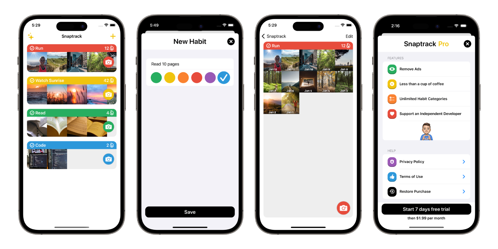
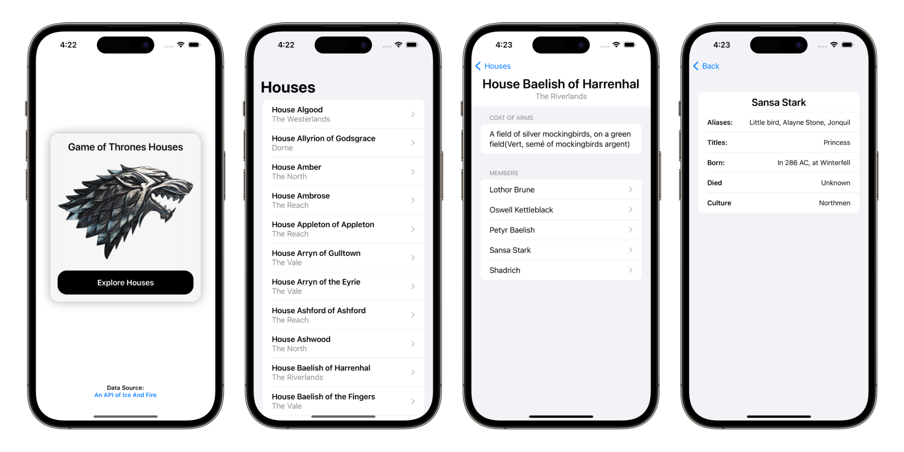
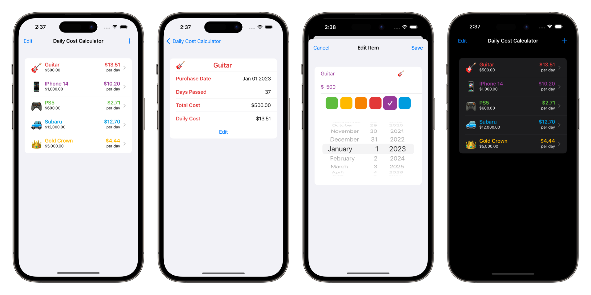
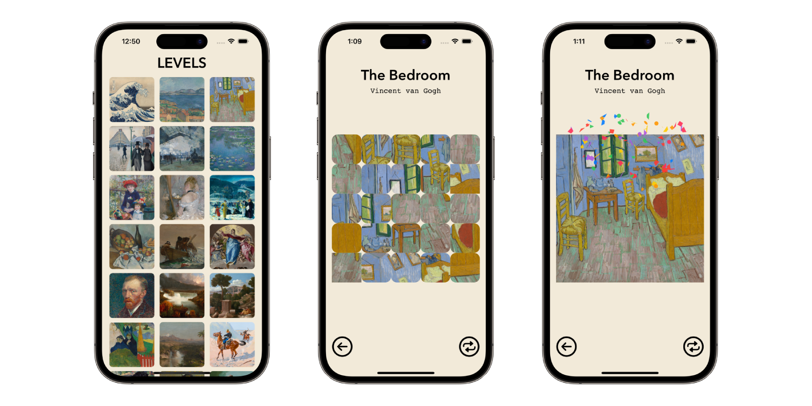

<h1 align="center">
  Conner Tate
</h1>
<h2 align="center">
  iOS Engineer
</h2>

  

<h1 align="center">
Experience
</h1>

📚 Bachelors in Computer Science from The University of North Carolina at Chapel Hill - 2020

🎬 Working on set for TV shows in Charleston SC & Wilmington NC

📱 9 apps on the App Store with 7k+ combined downloads

<h1 align="center">
Apps Developed
</h1>

  All projects are designed and created independently

## Snaptrack - Habit Tracker 

  

### Features
- Track habits visually using photos from the camera
- Daily streaks build motivation and habits
- Monitized with in app ads & subscription to remove them and unlock features

### Technologies 
- Swift, SwiftUI, UIKit, Google Admob, RevenueCat purchases, Apple subscriptions

  

***

## Game of Thrones House Viewer 

  

### Features
- Explore info about all the houses in Game of Thrones 
- Data is concurrently loaded in the background from https://anapioficeandfire.com

### Technologies 
- Swift, SwiftUI, URLSession, JSON Decoder, Async / Await, REST API

  

***

## Daily Cost Calculator 

  

### Features
- Add custom expenses to track and calculate time passed and average cost
- Edit past expenses to change values

### Technologies 
- Swift, SwiftUI, Core Data, Google Admob

  

***

## Art Slide Puzzle 

  

### Features
- Swap around art piece tiles to complete the full work of art

### Technologies 
- Swift, SwiftUI

  

***

# Contact Information
  
📫 Email: connertate8@gmail.com

🖇️ LinkedIn: https://www.linkedin.com/in/conner-t-193b1a131/

✅ LeetCode: https://leetcode.com/connertate8/

  

