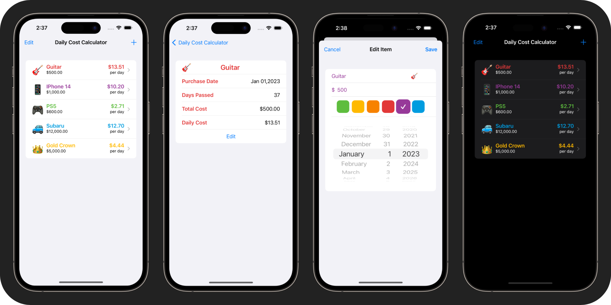

  

<h1 align="center">
Conner Tate
</h1>

👋 Hey! I'm Conner, an iOS Developer with a passion for designing and building apps. 

<h1 align="center">
Experience
</h1>

📚 Bachelors in Computer Science from The University of North Carolina at Chapel Hill - 2020

🎬 Working on set in film industry for TV shows in Charleston, SC & Wilmington, NC.

👨🏻‍💻 I make iOS apps in my free time and want to pursue a career in mobile development

📱 I have released 9 apps as a solo developer to the Apple App Store with combined downloads of 7k+.

<h1 align="center">
Apps Developed
</h1>

## Daily Cost Calculator 

  

  

### Problem
- I wanted to be able to track how my largest financial purchases average down to a daily cost as time passes.

### Summary / features
- Add custom expenses to track and calculate time passed and average cost
- Edit past expenses to change values

### Technologies Used
- Swift, SwiftUI, Core Data, Google Admob

# Technical Skills

I have extensive experience with the following technologies:
- Swift
- Xcode

# Contact Information
  
📫 Email: connertate8@gmail.com

🖇️ LinkedIn: https://www.linkedin.com/in/conner-t-193b1a131/

🐦 Twitter: https://twitter.com/connertate8

✅ LeetCode: https://leetcode.com/connertate8/
